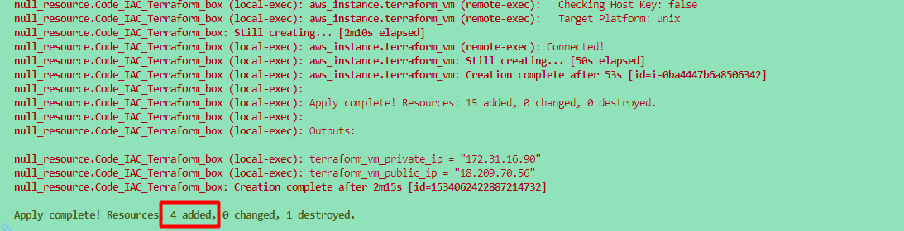
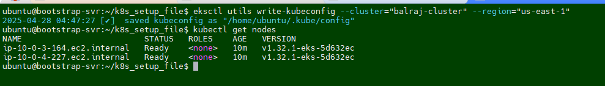
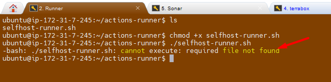

<!-- 
# TESTING DOCUMENT USING GITHUB PAGES ...~!!!
- Kubernetes Made Easy: Terraform-Powered EKS Provisioning with GitHub Actions CI/CD
- Technical Project project: GitHub Actions CI/CD Pipeline with Live Project
# https://github.com/user-attachments/assets/b93fa528-6778-4c97-94ee-6e36c7f4fa8e


---


# Streamlining AWS Integration with GitHub Actions: A Secure and Scalable Approach Using `OpenID Connect`
 -->


## <span style="color: Yellow;"> Objective
The project demonstrates how to integrate GitHub Actions with AWS to automate workflows, such as uploading Docker images to AWS Elastic Container Registry (ECR). 

- Two approaches are explored:

  - Using manually generated AWS access keys and secret keys.
  - Using OpenID Connect (OIDC) for secure and temporary token-based authentication.

---
## <span style="color: Yellow;"> Prerequisites </span>
Before diving into this project, here are some skills and tools you should be familiar with:

- Terraform is installed on your machine.
- A GitHub account.
- A GitHub personal access token with the necessary permissions to create repositories.

- [Clone repository for terraform code](https://github.com/mrbalraj007/GitHub-Action-OIDCConnect.git)<br>

  > 💡 **Note:** *Replace resource names and variables as per your requirement in terraform.tfvars file as below*
    ```sh
        aws_region             = "us-east-1"
        github_repo_sub        = "repo:xxxxxxxxxxxxxx/GitHub-Action-OIDCConnect:*"    # Update here your GitHub account name and repo 
        web_identity_role_name = "github-actions-web-identity-role" # It will be created as part of Terraform, in case you want to use different then change it.
        web_identity_repo_sub  = "repo:xxxxxxxxxxxxxxxxx/GitHub-Action-OIDCConnect:ref:refs/heads/main" # Update here your GitHub account name and repo
        additional_policy_arn  = "arn:aws:iam::aws:policy/AmazonEC2ReadOnlyAccess"
    ```
      
- **Set up your GitHub token**:
   - Create a new GitHub personal access token with the `repo` scope at https://github.com/settings/tokens. 
   - Then set it as an environment variable (DO NOT commit your token to version control):
   
        ```bash
        # For Linux/macOS
        export GITHUB_TOKEN=your_github_token
        
        # For Windows Command Prompt
        set GITHUB_TOKEN=your_github_token
        
        # For Windows PowerShell (I used this one)
        # $env:GITHUB_TOKEN="your_github_token"
        $env:TF_VAR_github_token = "your-github-personal-access-token"
        ```
- **Test and verify with curl again in powershell terminal:**
    ```powershell
    $headers = @{
        Authorization = "token $env:TF_VAR_github_token"
    }
    Invoke-WebRequest -Uri "https://api.github.com/user" -Headers $headers
    ```
   - You should see your GitHub user info in JSON, **not** "Bad credentials".
---

## <span style="color: Yellow;"> Key Points

### <span style="color: Cyan;"> **Approach 1**: Manual Access Keys

- Create an IAM user in AWS.
- Generate access keys and secret keys.
- Configure these keys as repository secrets in GitHub.
- Use these secrets in GitHub Actions workflows to authenticate and perform operations on AWS.

### <span style="color: Cyan;"> **Approach 2**: OpenID Connect (OIDC)

- Configure OpenID Connect as an identity provider in AWS.
- Assign roles to allow GitHub Actions to access AWS resources.
- Use the role's ARN in the GitHub Actions workflow for authentication.
- No need to manage or rotate access keys manually.
- Tools and Technologies Used

## <span style="color: Yellow;"> GitHub Actions: For automating workflows.
- **AWS IAM**: For managing users, roles, and permissions.
- **AWS ECR**: As the target service for Docker image uploads.
- **OpenID Connect (OIDC)**: For secure, token-based authentication.
Challenges

### **Manual Key Management**: 
In the first approach, managing and rotating keys is cumbersome and prone to errors.
- **Configuration Errors**: Issues like incorrect indentation or missing permissions in the workflow file can cause failures.
- **Security Risks**: Using administrator access in IAM roles is not recommended in real-world scenarios.

## **Benefits of using OIDC**

- Improved Security: OIDC eliminates the need for long-term credentials, reducing the risk of key leakage.
- Ease of Maintenance: No need to rotate keys periodically with OIDC.
- **Scalability**: OIDC allows seamless integration across multiple repositories and branches.

## Step-by-Step Process

### Manual Access Keys Approach

- Create an IAM user in AWS with the required permissions.
- Generate access keys and secret keys.
- Add these keys as repository secrets in GitHub.
- Configure a GitHub Actions workflow to use these secrets for AWS operations.

    > ⚠️ **Important:** &rArr;<span style="color: Green;"> Here is the [Updated YAML](https://github.com/mrbalraj007/GitHub-Action-OIDCConnect/blob/main/.github/workflows/AWSConnectionWithManual.yml) file formanually approach.

--- 
🚀 **I'll be demonstrating the second approach to setting up OIDC.** 🚀
### OpenID Connect Approach

#### <span style="color: Yellow;">Setting Up the OIDC in AWS </span>

- I have created a Terraform code to set up the OIDC, roles and permissions to automatically created.
- Once you [clone repo](https://github.com/mrbalraj007/GitHub-Action-OIDCConnect.git) then go to folder *<span style="color: cyan;">"GitHub-Action-OIDCConnect/Terraform_Code_Infra_setup"</span>* and run the terraform command.

    ```bash
    $ cd GitHub-Action-OIDCConnect/Terraform_Code_Infra_setup

    $ ls
    oidc-setup.tf  provider.tf  terraform.tfstate  terraform.tfstate.backup  terraform.tfvars  variables.tf  web_identity_roles.tf  
    ```

You need to run terraform using the following command:

```bash
terraform init
terraform fmt
terraform validate
terraform plan
terraform apply 
# Optional <terraform apply --auto-approve>
```
-------


Once you run the terraform command, then we will verify the following things to make sure everything is setup properly via a terraform.

- Verify OpenID Connect as an identity provider in AWS.
 

- Verify Assign a role and permission to the identity provider with specific permissions.



- Update secrets and variables in GitHub Actions workflow to use the role's ARN for authentication.


- Ensure the workflow file includes the required permissions block for OIDC.
- Here is the 🗎 [Updated YAML](https://github.com/mrbalraj007/GitHub-Action-OIDCConnect/blob/main/.github/workflows/AWSConnectionWithOIDC.yml)file for OIDC.

**Testing**

- Run the GitHub Actions workflow to verify AWS authentication and operations.
  
  
  
- Debug and fix any errors, such as missing permissions or incorrect configurations.


## <span style="color: Yellow;"> Environment Cleanup:

### <span style="color: cyan;"> To delete `OIDC, Roles and Permissions`
   -   Go to directory `GitHub-Action-OIDCConnect/Terraform_Code_Infra_setupand` and run the following command to delete the cluster.
       ```sh
         terraform destroy --auto-approve
       ```


## **Conclusion**
The project highlights the advantages of using OpenID Connect over manual access keys for integrating GitHub Actions with AWS. OIDC provides a more secure, scalable, and maintenance-free solution, making it the recommended approach for real-world applications. By adopting OIDC, teams can focus on building and deploying applications without worrying about credential management.

__Ref Link:__
- [configuring-openid-connect-in-amazon-web-services](https://docs.github.com/en/actions/security-for-github-actions/security-hardening-your-deployments/configuring-openid-connect-in-amazon-web-services)

- [GitHub Action Market Place-  Configure-aws-credentials](https://github.com/aws-actions/configure-aws-credentials)
- [YouTube Vidoes](https://www.youtube.com/watch?v=uNbzEGzyDjc&list=PLJcpyd04zn7pdlV_nLLx349jl2CSuG50q&index=10)